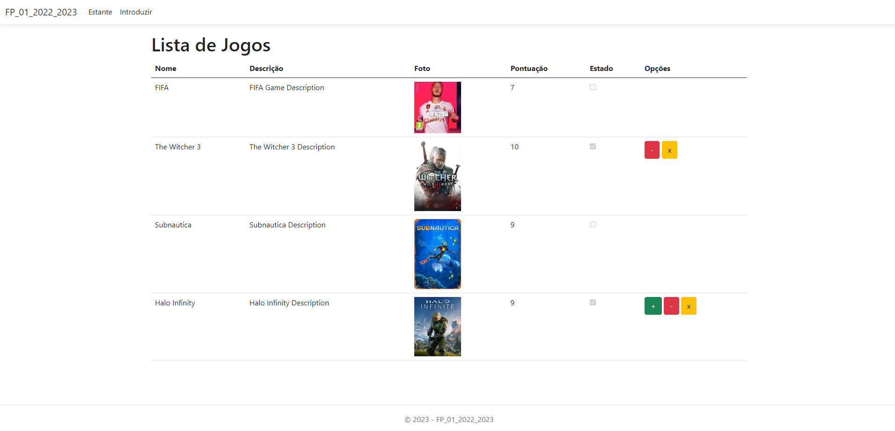

<h1>Shift 2 - Practical Frequency 1 - 2022/2023</h1>

- This frequency asked for a Web application in ASP.NET Core MVC in charge of managing a virtual game shelf.
- It is possible to add new games, increase/decrease their score (from 0 to 10), and change their state from true to false.
- NOTE: Only images in .jpg format are accepted.
- NOTE: The database represented below is not included.

<h2>The application has the following interface:</h2>

