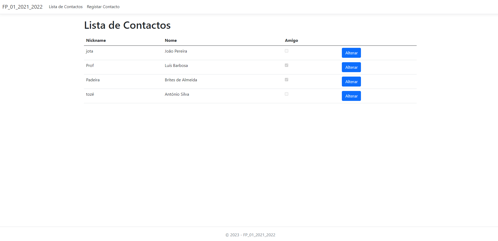

<h1>Shift 2 - Practical Frequency 1 - 2022/2023</h1>

- This frequency asked for a Web application in ASP.NET Core MVC in charge of managing a virtual contacts list.
- It is possible to add new contacts and edit them.
- There is a routing rule applied to "/Amigos", that filters the list of contacts to display only contacts that are friends.
- NOTE: The database represented below is not included.

<h2>The application has the following interface:</h2>

