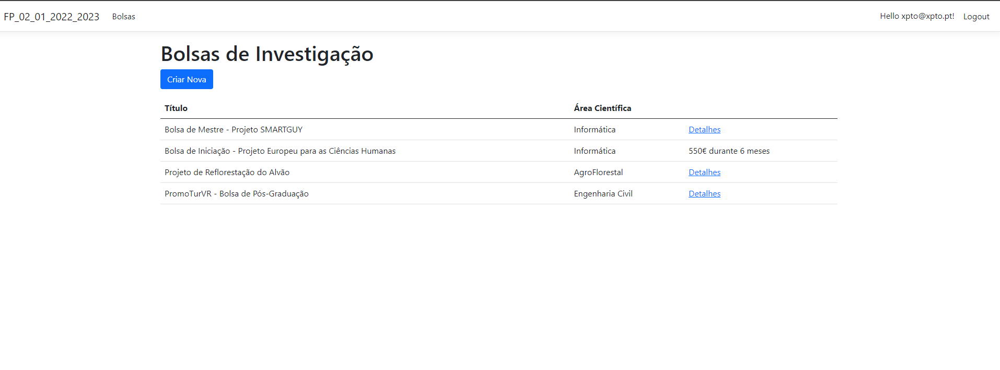

<h1>Shift 1 - Practical Frequency 2 - 2022/2023</h1>

- This frequency asked for a Web application in ASP.NET Core MVC with a login system made with Identity Framework that was able to manage a list of research grants.
- The exercise nº 5 is not done.
- NOTE: The database represented below is not included.

<h2>The application has the following interface:</h2>

