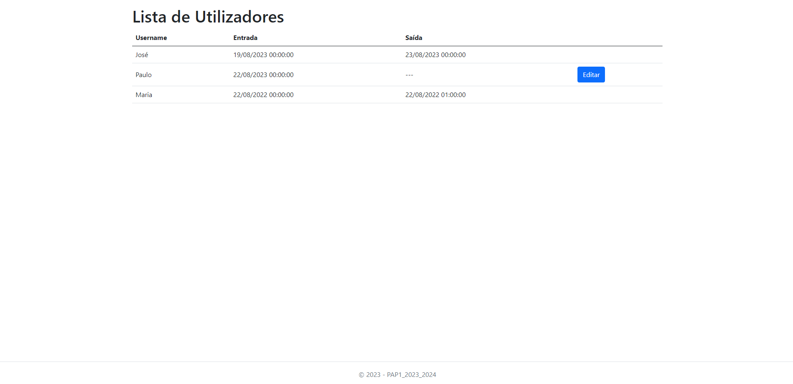

<h1>Shift 1 - Practical Frequency 1 - 2023/2024</h1>

- This frequency asked for a Web application in ASP.NET Core MVC in charge of managing a list of employees.
- It is possible to edit employees which do not have a leave date set, however, the leave date/time, can not be lesser than the entry date/time.
- NOTE: The database represented below is not included.

<h2>The application has the following interface:</h2>

